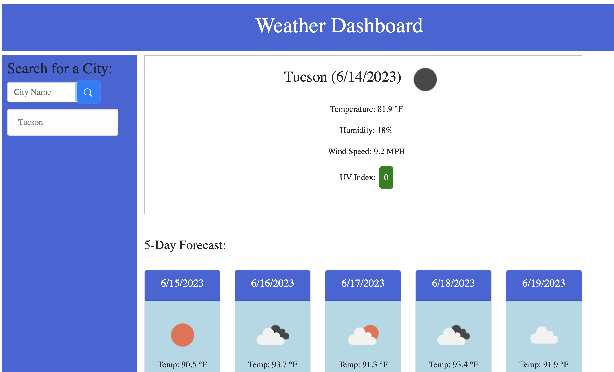

# Description
This program will fetch data from a server side api to display a 5 day weather forecast of a city that the user chooses to search for. The cities that are searched by the user will also be stored in local storage.

## Installation
N/A

## Usage
Users need only a computer with a stable internet connection, and a city in mind to search for!
In order to use the program, the user simply needs to type in any city in the search bar.
Deployed github URL: https://alugo0823.github.io/weather-dashboard/

## Credits
N/A

## Built with
* JavaScript/JQuery
* CSS/Bootstrap
* HTML
* Server side API
## License
MIT License